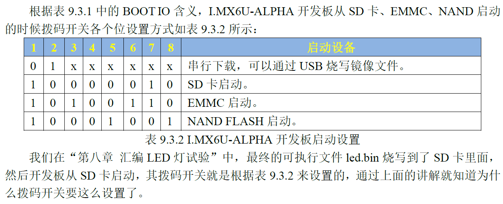

<style>
img{
    width: 30%;
    padding-left: 30%;
}
</style>

# Brief Description
正点原子，阿尔法Linux。
对应虚拟机csy-alientek-vm，密码0。

# Dev Description
2023/04/12
目前提供一个仓库，一个管理账户，三个开发账户，分别为：
 
| Index | Device | Version               | Type      | Account              | Local Branch             |
| :---  | :----: | :---:                 |   :---:   | :---:                | :---:                    |
| 1     | PC     | Windows 10            | Owner     | csy-admin            | csy-pc-dev               |
| 2     | PC     | VMware16.1.0 alientek | Developer | csy-pc-alientek-VM   | csy-pc-alientek-VM-dev   |
| 3     | Yoga   | Windows 10            | Developer | csy-yoga-dev         | csy-yoga                 |
| 4     | Yoga   | VMware16.1.0 alientek | Developer | csy-yoga-alientek-VM | csy-yoga-alientek-VM-dev |


# Installed Software of Virtual Machine
Virtual Machine -- VMware 16.1.0 
**DO NOT USE VirtualBox**
**切勿使用VMware15.xxx，会导致Windows10死机，必须使用VMware16.xxx。**


# Getting started
```
git clone ssh://git@192.168.8.106:7022/csy-admin/arm-linux.git
git checkout -b <YourLocalBranchName>
git add .
git commit -m "Write your comment here."
git push origin <YourLocalBranchName>
git checkout main
git pull origin main
git checkout <yourLocalBranchName>
git rebase main
git rebase --continue
git push -f origin <yourLocalBranchName>
```

# BOOT Mode Selection


***
Shell script header
#!/bin/bash
**DO NOT Forget to use change mode cmd.**
***

# U-Boot compile command
## 512MB(DDR3)+8GB(EMMC)核心板
make ARCH=arm CROSS_COMPILE=arm-linux-gnueabihf- distclean
make ARCH=arm CROSS_COMPILE=arm-linux-gnueabihf- mx6ull_14x14_ddr512_emmc_defconfig
make V=1 ARCH=arm CROSS_COMPILE=arm-linux-gnueabihf- -j12

## 256MB(DDR3)+ 512MB(NAND)核心板
make ARCH=arm CROSS_COMPILE=arm-linux-gnueabihf- distclean
make ARCH=arm CROSS_COMPILE=arm-linux-gnueabihf- mx6ull_14x14_ddr256_nand_defconfig
make V=1 ARCH=arm CROSS_COMPILE=arm-linux-gnueabihf- -j12

## 常用命令
### 新建 & 删除环境变量
[] 新建 -- setenv ENV-VAR value
[] 删除 -- setenv ENV-VAR

### 网络测试
只能通过开发板ping其他主机，反向不行。

### NFS CMD
